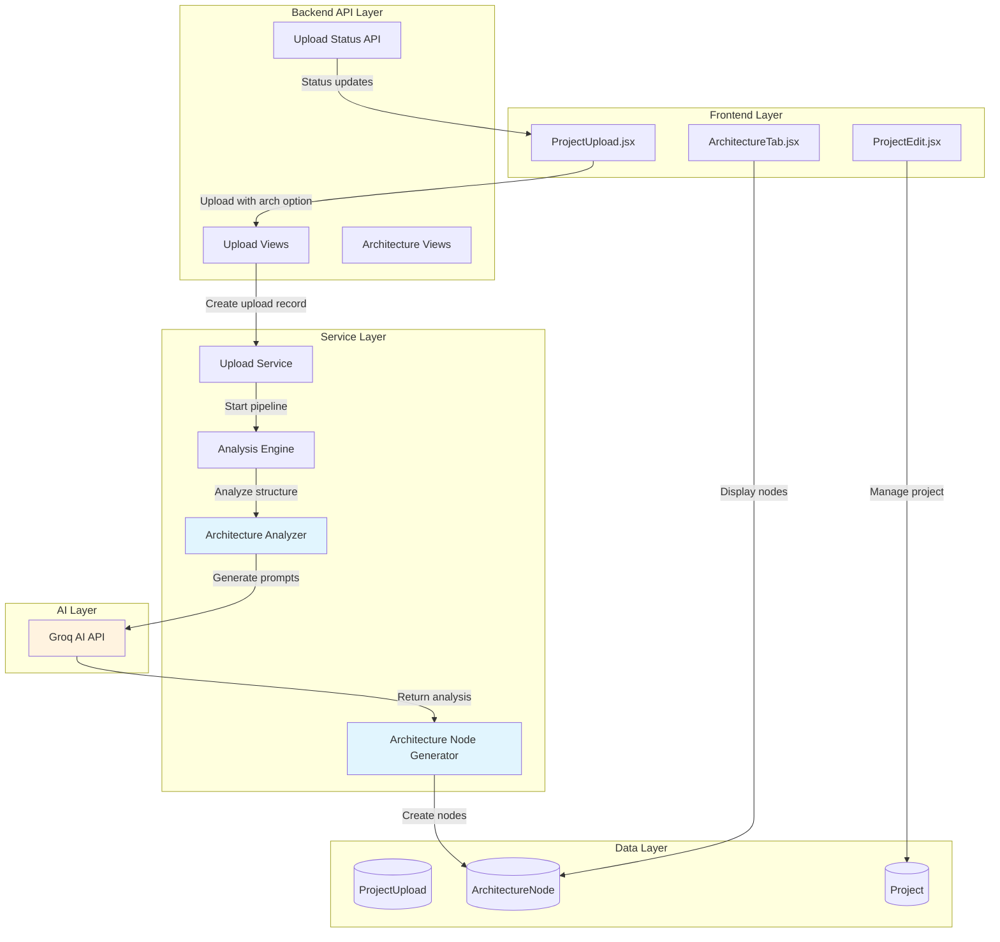

# Design Document: AI Architecture Generation

## Overview

The AI Architecture Generation feature enhances the existing auto-endpoint detection workflow by automatically analyzing uploaded source code and generating project architecture diagrams. This feature integrates seamlessly with the current upload process, allowing users to optionally request AI-generated architecture nodes that populate the existing ReactFlow architecture diagram.

The system leverages the existing Groq AI integration and analysis pipeline to examine project structure, dependencies, and code patterns to identify architectural components. Generated nodes are compatible with the existing architecture editor, allowing users to modify, reposition, or delete AI-generated components using familiar tools.

### Key Benefits

- **Automated Architecture Discovery**: Reduces manual effort in creating architecture diagrams
- **Seamless Integration**: Works within existing upload workflow without disrupting current functionality  
- **Technology Agnostic**: Supports the same languages and frameworks as endpoint detection
- **User Control**: Generated nodes can be fully customized or removed by users
- **Progressive Enhancement**: Optional feature that enhances rather than replaces manual architecture creation

## Architecture

The AI Architecture Generation system extends the existing auto-endpoint detection pipeline with new components for architecture analysis and node generation. The architecture follows the established patterns in the codebase while adding specialized services for architectural analysis.



### Integration Points

1. **Upload Workflow Integration**: Extends ProjectUpload.jsx with architecture generation checkbox
2. **Analysis Pipeline Extension**: Adds architecture analysis to existing AnalysisEngine
3. **Database Integration**: Utilizes existing ArchitectureNode model with potential enhancements
4. **ReactFlow Integration**: Generated nodes appear in existing ArchitectureTab.jsx interface
5. **Progress Tracking**: Leverages existing ProjectUpload status system

## Components and Interfaces

### Frontend Components

#### Enhanced ProjectUpload Component
**Location**: `devshowcase_frontend/src/components/ProjectUpload.jsx`

**New Features**:
- Architecture generation checkbox option
- Progress messages for architecture analysis phases
- Error handling for architecture generation failures

**Interface Changes**:
```javascript
// New state for architecture generation option
const [generateArchitecture, setGenerateArchitecture] = useState(false)

// Enhanced upload payload
const uploadPayload = {
  ...existingData,
  generate_architecture: generateArchitecture
}
```

#### ArchitectureTab Component
**Location**: `devshowcase_frontend/src/components/editor/ArchitectureTab.jsx`

**Enhancements**:
- Display AI-generated vs manual nodes with visual indicators
- Regeneration functionality for architecture diagrams
- Improved node positioning and layout algorithms

### Backend Services

#### Architecture Analyzer Service
**Location**: `devshowcase_backend/projects/services/architecture_analyzer.py`

**Purpose**: Analyzes project structure and identifies architectural components

**Key Methods**:
```python
class ArchitectureAnalyzer:
    def analyze_project_structure(self, directory_path: str) -> Dict
    def identify_components(self, file_structure: Dict) -> List[Component]
    def detect_frameworks_and_technologies(self, files: List[Path]) -> Dict
    def analyze_dependencies(self, dependency_files: List[Path]) -> List[Dependency]
    def detect_service_connections(self, config_files: List[Path]) -> List[Connection]
```

**Analysis Capabilities**:
- Directory structure examination
- Framework detection (React, Vue, Angular, Express, Django, Flask, etc.)
- Database identification from dependencies and configurations
- External service detection (AWS, Stripe, SendGrid, etc.)
- Microservice boundary identification

#### Architecture Node Generator Service
**Location**: `devshowcase_backend/projects/services/architecture_node_generator.py`

**Purpose**: Creates ArchitectureNode objects from analysis results

**Key Methods**:
```python
class ArchitectureNodeGenerator:
    def generate_nodes(self, components: List[Component]) -> List[ArchitectureNode]
    def calculate_positions(self, nodes: List[ArchitectureNode]) -> List[ArchitectureNode]
    def assign_technologies(self, component: Component) -> str
    def generate_descriptions(self, component: Component) -> str
    def avoid_naming_conflicts(self, nodes: List[ArchitectureNode], existing: List[ArchitectureNode]) -> List[ArchitectureNode]
```

**Positioning Algorithm**:
- Frontend components: Left side (x: 100-300)
- Backend components: Center (x: 400-600) 
- Database components: Right side (x: 700-900)
- External services: Top/bottom based on role
- Vertical spacing: 150px minimum between nodes

### API Endpoints

#### Enhanced Upload Endpoints
**Existing endpoints extended with architecture generation support**:

```python
# POST /api/projects/{project_id}/upload/files/
# POST /api/projects/{project_id}/upload/zip/  
# POST /api/projects/{project_id}/upload/github/

# New request parameter:
{
    "generate_architecture": boolean  # Optional, defaults to false
}
```

#### New Architecture Management Endpoints

```python
# POST /api/projects/{project_id}/architecture/regenerate/
# Regenerate architecture for existing project
{
    "preserve_manual_nodes": boolean,  # Default: true
    "replace_ai_nodes": boolean        # Default: true
}

# GET /api/projects/{project_id}/architecture/status/
# Get architecture generation status
Response: {
    "has_ai_generated": boolean,
    "ai_node_count": integer,
    "manual_node_count": integer,
    "last_generated": datetime
}
```

### Database Schema

#### ArchitectureNode Model Enhancement
**Location**: `devshowcase_backend/projects/models.py`

**New Fields**:
```python
class ArchitectureNode(models.Model):
    # Existing fields...
    name = models.CharField(max_length=100)
    technology = models.CharField(max_length=100)
    description = models.TextField()
    x_position = models.FloatField(default=0)
    y_position = models.FloatField(default=0)
    
    # New fields for AI generation tracking
    is_ai_generated = models.BooleanField(default=False)
    ai_generation_source = models.CharField(max_length=100, blank=True)  # e.g., "package.json", "requirements.txt"
    created_by_upload = models.ForeignKey('ProjectUpload', on_delete=models.SET_NULL, null=True, blank=True)
    ai_confidence_score = models.FloatField(null=True, blank=True)  # 0.0-1.0 confidence in detection
```

#### ProjectUpload Model Enhancement
**New Fields**:
```python
class ProjectUpload(models.Model):
    # Existing fields...
    
    # Architecture generation fields
    generate_architecture = models.BooleanField(default=False)
    architecture_nodes_created = models.IntegerField(default=0)
    architecture_analysis_data = models.JSONField(default=dict, blank=True)  # Store raw analysis for debugging
```

## Data Models

### Component Analysis Data Structure

```python
@dataclass
class ArchitecturalComponent:
    name: str
    component_type: ComponentType  # FRONTEND, BACKEND, DATABASE, EXTERNAL_SERVICE, MIDDLEWARE
    technology: str
    description: str
    confidence_score: float
    source_files: List[str]
    dependencies: List[str]
    suggested_position: Tuple[float, float]
    
class ComponentType(Enum):
    FRONTEND = "frontend"
    BACKEND = "backend" 
    DATABASE = "database"
    EXTERNAL_SERVICE = "external_service"
    MIDDLEWARE = "middleware"
    MESSAGE_QUEUE = "message_queue"
    CACHE = "cache"
    API_GATEWAY = "api_gateway"
```

### AI Analysis Response Format

```python
{
    "project_type": "full_stack",  # monolithic, microservices, frontend_only, api_only
    "detected_frameworks": [
        {
            "name": "React",
            "type": "frontend",
            "confidence": 0.95,
            "evidence": ["package.json", "src/App.jsx"]
        }
    ],
    "components": [
        {
            "name": "React Frontend",
            "type": "frontend",
            "technology": "React 18",
            "description": "Main user interface built with React and modern hooks",
            "confidence": 0.9,
            "source_files": ["src/App.jsx", "src/components/"],
            "position": {"x": 200, "y": 100}
        }
    ],
    "suggested_connections": [
        {
            "from": "React Frontend",
            "to": "Express API",
            "type": "http_requests"
        }
    ]
}
```

### Node Positioning Algorithm

```python
class NodePositioner:
    LAYOUT_CONFIG = {
        "frontend": {"x_range": (100, 300), "y_start": 100},
        "backend": {"x_range": (400, 600), "y_start": 100}, 
        "database": {"x_range": (700, 900), "y_start": 100},
        "external_service": {"x_range": (400, 600), "y_start": 400},
        "middleware": {"x_range": (400, 600), "y_start": 250}
    }
    
    MIN_VERTICAL_SPACING = 150
    MIN_HORIZONTAL_SPACING = 200
```

## Correctness Properties

*A property is a characteristic or behavior that should hold true across all valid executions of a system-essentially, a formal statement about what the system should do. Properties serve as the bridge between human-readable specifications and machine-verifiable correctness guarantees.*

### Property 1: Architecture Generation Option Integration

*For any* upload workflow invocation, when architecture generation is requested, the system should include architecture analysis in the upload process, and when not requested, the system should proceed with endpoint detection only.

**Validates: Requirements 1.3, 1.4, 1.5**

### Property 2: Comprehensive Component Analysis

*For any* project directory with detectable components, the Codebase_Analyzer should identify all architectural components including frontend, backend, database, external services, and their associated technologies from code structure, dependencies, and configuration files.

**Validates: Requirements 2.1, 2.2, 2.3, 2.4, 2.5, 2.6**

### Property 3: Node Generation Completeness

*For any* set of identified architectural components, the Node_Generator should create corresponding ArchitectureNode objects with appropriate names, technology labels, descriptions, and ReactFlow-compatible format.

**Validates: Requirements 3.1, 3.2, 3.3, 3.5, 3.6**

### Property 4: Intelligent Node Positioning

*For any* set of generated architecture nodes, the positioning algorithm should place frontend components on the left (x: 100-300), backend components in center (x: 400-600), database components on right (x: 700-900), maintain minimum 150px spacing between all nodes, and ensure no overlapping positions.

**Validates: Requirements 3.4, 4.1, 4.2, 4.3, 4.4, 4.5, 4.6**

### Property 5: Architecture Integration Preservation

*For any* project with existing manual architecture nodes, AI generation should preserve all existing manual nodes, add generated nodes to the project's architecture data, and ensure both types of nodes appear in the ReactFlow diagram.

**Validates: Requirements 5.1, 5.2, 5.3, 11.1, 11.5**

### Property 6: Node Editability Consistency

*For any* AI-generated architecture node, the Architecture Editor should allow full modification (name, technology, description, position) and deletion with the same capabilities as manual nodes.

**Validates: Requirements 5.4, 5.5**

### Property 7: Multi-Language Framework Detection

*For any* project containing supported programming languages (JavaScript/TypeScript, Python, Java, C#, mixed-language), the Codebase_Analyzer should correctly detect framework-specific components (React, Vue, Angular, Express, NestJS, Django, Flask, FastAPI, Spring Boot, ASP.NET, etc.) with the same language support as the existing endpoint detection system.

**Validates: Requirements 8.1, 8.2, 8.3, 8.4, 8.5, 8.6**

### Property 8: Project Type Adaptability

*For any* project type (monolithic, microservices, full-stack, API-only, frontend-only), the Codebase_Analyzer should identify components appropriate to that project type, and when project type cannot be determined, should create generic nodes based on detected files.

**Validates: Requirements 7.1, 7.2, 7.3, 7.4, 7.5, 7.6**

### Property 9: Component-Specific Node Labeling

*For any* detected architectural component, the Node_Generator should assign technology labels specific to the component type (framework-specific labels for web servers, database type labels for databases, API type labels for APIs, service names for external services, purpose labels for middleware).

**Validates: Requirements 9.1, 9.2, 9.3, 9.4, 9.5, 9.6**

### Property 10: Upload Workflow Resilience

*For any* architecture generation failure scenario, the upload workflow should continue with endpoint detection and allow manual architecture creation without disrupting the core functionality.

**Validates: Requirements 10.5**

### Property 11: Name Conflict Resolution

*For any* AI-generated nodes that have similar names to existing nodes, the Node_Generator should append suffixes to create unique names and position new nodes to avoid conflicts with existing node positions.

**Validates: Requirements 11.2, 11.3**

### Property 12: Architecture Regeneration Selectivity

*For any* architecture regeneration request, the system should identify previously AI-generated nodes, replace only AI-generated nodes while preserving manual nodes, detect new components to create additional nodes, and remove AI-generated nodes for components that no longer exist.

**Validates: Requirements 12.2, 12.3, 12.4, 12.5**

## Error Handling

The AI Architecture Generation system implements comprehensive error handling to ensure the upload workflow remains robust even when architecture generation encounters issues.

### Error Categories and Responses

#### Analysis Failures
- **No Components Detected**: Display informative message and continue with endpoint detection
- **Framework Detection Failure**: Fall back to generic component detection based on file types
- **AI Service Unavailable**: Display service unavailability message and continue upload workflow

#### Generation Failures  
- **Node Creation Failure**: Log error, display user-friendly message, continue with endpoint detection
- **Positioning Algorithm Failure**: Fall back to default grid layout with 200px spacing
- **Database Save Failure**: Retry once, then display error and continue workflow

#### Integration Failures
- **ReactFlow Compatibility Issues**: Validate node format and fix common issues automatically
- **Naming Conflicts**: Implement automatic suffix generation (e.g., "API Server (2)")
- **Position Conflicts**: Implement automatic repositioning with minimum spacing

### Fallback Mechanisms

```python
class ArchitectureGenerationErrorHandler:
    def handle_analysis_failure(self, error: Exception) -> None:
        """Continue upload workflow without architecture generation"""
        
    def handle_ai_service_failure(self, error: Exception) -> None:
        """Display service unavailable message, continue workflow"""
        
    def handle_positioning_failure(self, nodes: List[ArchitectureNode]) -> List[ArchitectureNode]:
        """Apply default grid layout as fallback"""
        
    def handle_naming_conflicts(self, new_nodes: List[ArchitectureNode], existing: List[ArchitectureNode]) -> List[ArchitectureNode]:
        """Append suffixes to resolve naming conflicts"""
```

### User Communication

Error messages are designed to be informative without being technical:
- "Architecture analysis couldn't detect components in your project. You can still add architecture nodes manually."
- "Architecture generation is temporarily unavailable. Your code analysis will continue normally."
- "Some architecture nodes couldn't be positioned automatically and were placed in a grid layout."

## Testing Strategy

The AI Architecture Generation feature requires a dual testing approach combining unit tests for specific scenarios and property-based tests for comprehensive coverage across diverse project structures.

### Unit Testing Focus

Unit tests handle specific examples, edge cases, and error conditions:

**Component Detection Tests**:
- Test detection of specific frameworks (React, Django, Spring Boot)
- Test edge cases like empty projects, mixed-language projects
- Test error conditions like corrupted package files

**Node Generation Tests**:
- Test specific positioning scenarios (3 frontend + 2 backend components)
- Test naming conflict resolution with known examples
- Test ReactFlow format compatibility

**Integration Tests**:
- Test upload workflow with architecture generation enabled/disabled
- Test database operations for node creation and updates
- Test API endpoint responses for architecture management

**UI Component Tests**:
- Test checkbox appearance and behavior in ProjectUpload component
- Test node display and editing in ArchitectureTab component
- Test progress message display during generation

### Property-Based Testing Configuration

Property-based tests verify universal properties across all inputs using **Hypothesis** for Python backend and **fast-check** for JavaScript frontend components. Each test runs a minimum of 100 iterations to ensure comprehensive coverage.

**Backend Property Tests** (using Hypothesis):
```python
@given(project_structure=project_structures(), frameworks=framework_combinations())
def test_component_analysis_completeness(project_structure, frameworks):
    """Property 2: Comprehensive Component Analysis"""
    # Test implementation
    pass

@given(components=architectural_components())  
def test_node_positioning_constraints(components):
    """Property 4: Intelligent Node Positioning"""
    # Test implementation
    pass
```

**Frontend Property Tests** (using fast-check):
```javascript
fc.test('Architecture generation option integration', fc.boolean(), (generateArch) => {
  // Property 1: Architecture Generation Option Integration
  // Test implementation
})
```

**Property Test Tags**:
Each property test includes a comment tag referencing the design document:
```python
# Feature: ai-architecture-generation, Property 1: Architecture generation option integration
# Feature: ai-architecture-generation, Property 4: Intelligent node positioning
```

**Test Data Generators**:
- `project_structures()`: Generates diverse project directory structures
- `framework_combinations()`: Generates various framework and technology combinations  
- `architectural_components()`: Generates component data with different types and configurations
- `existing_node_sets()`: Generates sets of existing manual nodes for conflict testing

### Integration with Existing Test Suite

The architecture generation tests integrate with the existing test infrastructure:
- Use existing Django test database setup
- Leverage existing Groq AI mocking utilities
- Extend existing upload workflow test fixtures
- Reuse ReactFlow testing utilities

### Performance Testing

While not part of correctness properties, performance tests ensure the feature scales appropriately:
- Test analysis time for projects with 100+ files
- Test memory usage during large project analysis
- Test concurrent architecture generation requests
- Test AI API rate limiting and retry logic

The testing strategy ensures both correctness and reliability while maintaining the existing quality standards of the DevShowcase platform.