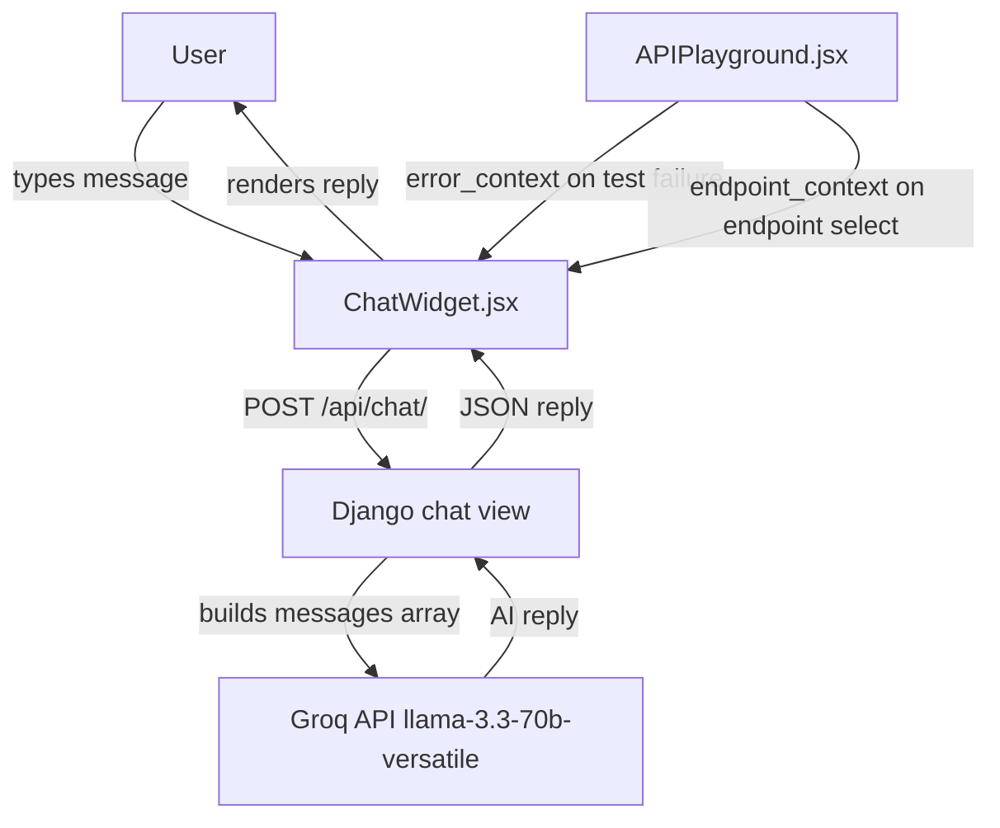

# Design Document: AI Chatbot Assistant

## Overview

The AI Chatbot Assistant adds a floating chat widget to the DevShowcase frontend that lets users ask questions and get contextual help from an AI assistant. The assistant is powered by Groq's `llama-3.3-70b-versatile` model via the existing Groq integration in the backend.

The primary use cases are:
- Explaining sandbox execution errors and API test failures in plain language
- Suggesting test cases for selected API endpoints
- Answering general questions about the DevShowcase platform and API development

The widget is mounted globally in `App.jsx` so it persists across all routes without page reloads. Context (error details, selected endpoint) is injected from `APIPlayground.jsx` when relevant.

---

## Architecture



The frontend widget manages its own local state (open/closed, message history). The backend view is stateless — the frontend sends the full conversation history (capped at 10 messages) with every request so the backend never needs to store session data.

---

## Components and Interfaces

### Frontend

**`ChatWidget.jsx`** — floating chat UI component

Props: none (reads context injected via a shared ref or callback from `APIPlayground`)

State:
- `isOpen: boolean` — controls expanded/collapsed state
- `messages: Array<{role, content}>` — in-memory conversation history (session only)
- `inputValue: string` — current text input
- `loading: boolean` — true while awaiting API response
- `errorContext: object | null` — injected from APIPlayground on test failure
- `endpointContext: object | null` — injected from APIPlayground when endpoint is selected

Key behaviours:
- Renders a fixed floating button (bottom-right) that toggles the chat panel
- On submit, appends user message to `messages`, POSTs to `/api/chat/`, appends AI reply
- History is capped at 10 messages before sending (oldest dropped first)
- On error response from backend, shows a fallback message
- When `errorContext` is set, shows a prompt banner offering to explain the error
- Accepts Enter key or send button to submit

**`ChatWidget.css`** — scoped styles for the widget, using the existing CSS custom properties from `index.css` (`--bg-secondary`, `--accent-primary`, `--text-primary`, etc.)

**`App.jsx` change** — import and render `<ChatWidget />` inside the `<Router>` wrapper, outside `<Routes>`, so it appears on every page.

**`APIPlayground.jsx` changes** — two additions:
1. After a failed sandbox/live test, call a `setChatErrorContext` callback (passed down or via a shared ref) with `{ method, path, status_code, error_message }`.
2. When an endpoint is selected, call `setChatEndpointContext` with `{ method, path, parameters, expected_responses }`.

The cleanest approach is to lift the `ChatWidget` state up slightly: `App.jsx` holds `errorContext` and `endpointContext` as state, passes setters down to `APIPlayground` via props through `ProjectView`, and passes the values as props to `ChatWidget`.

Alternatively (simpler for the existing prop-drilling depth), `ChatWidget` exposes an imperative handle via `useImperativeHandle`/`forwardRef` and `APIPlayground` calls it directly. Given the existing codebase style (no global state library), a simple callback prop passed through `ProjectView → APIPlayground` is the preferred approach.

### Backend

**`devshowcase_backend/chat/` app** — new Django app

Files:
- `views.py` — `chat_view` function-based view
- `urls.py` — single URL pattern
- `apps.py` — app config

Registered in `config/settings.py` `INSTALLED_APPS` and included in `config/urls.py` at `path('api/', include('chat.urls'))`.

**`chat_view`** — `@api_view(['POST'])` with `@permission_classes([AllowAny])`

Request body (JSON):
```json
{
  "message": "string (required)",
  "history": [{"role": "user|assistant", "content": "string"}],
  "error_context": {
    "method": "POST",
    "path": "/api/users",
    "status_code": 422,
    "error_message": "Unprocessable Entity"
  },
  "endpoint_context": {
    "method": "POST",
    "path": "/api/users",
    "parameters": [...],
    "expected_responses": [...]
  }
}
```

Response body (JSON):
```json
{ "reply": "string" }
```

Error responses:
- `400` — missing or empty `message`
- `503` — Groq API failure or timeout

---

## Data Models

No new database models are required. The chat is stateless on the backend — conversation history is owned by the frontend and sent with each request.

### Message object (in-memory, frontend only)

```typescript
interface Message {
  role: 'user' | 'assistant'
  content: string
}
```

### Request payload

```typescript
interface ChatRequest {
  message: string                    // required
  history?: Message[]                // up to 10 prior messages
  error_context?: {
    method: string
    path: string
    status_code: number
    error_message: string
  }
  endpoint_context?: {
    method: string
    path: string
    parameters?: object[]
    expected_responses?: object[]
  }
}
```

### Groq messages array (constructed in the view)

The view builds the `messages` array sent to Groq as:

1. System message (always present) — instructs the AI on its role, response length, and focus
2. History messages — from the `history` field, in order
3. Contextual injection — if `error_context` or `endpoint_context` is present, a synthetic user message is prepended to the final user message describing the context
4. Current user message

---

## Correctness Properties

*A property is a characteristic or behavior that should hold true across all valid executions of a system — essentially, a formal statement about what the system should do. Properties serve as the bridge between human-readable specifications and machine-verifiable correctness guarantees.*

### Property 1: Missing message returns 400

*For any* request to `POST /api/chat/` where the `message` field is absent or is a string composed entirely of whitespace, the response status code should be 400.

**Validates: Requirements 4.3**

### Property 2: Valid request returns reply

*For any* request to `POST /api/chat/` with a non-empty `message` field (and a mocked Groq client that returns a fixed string), the response status code should be 200 and the response body should contain a `reply` field with a non-empty string.

**Validates: Requirements 4.2**

### Property 3: History is forwarded to Groq

*For any* request containing a `history` array of up to 10 messages, the messages array constructed and sent to the Groq client should contain those history messages in the same order, preceded by the system message.

**Validates: Requirements 4.5**

### Property 4: Error context shapes the system prompt

*For any* request containing an `error_context` with a `status_code` in the range 400–499, the messages array sent to Groq should contain instructions focusing on client-side causes. For any `status_code` in the range 500–599, the instructions should focus on server-side causes.

**Validates: Requirements 3.3, 3.5, 3.6**

### Property 5: Endpoint context is forwarded to Groq

*For any* request containing an `endpoint_context` field, the messages array sent to Groq should include the endpoint method, path, and parameter details so the AI can generate targeted test case suggestions.

**Validates: Requirements 6.4**

### Property 6: History cap — at most 10 messages forwarded

*For any* `history` array sent by the frontend, the messages array forwarded to Groq should contain at most 10 history messages (the most recent ones), regardless of how many were sent.

**Validates: Requirements 4.5**

### Property 7: Chat widget toggles open and closed

*For any* initial state of the `ChatWidget`, clicking the floating button should toggle `isOpen` from `false` to `true`, and clicking it again should toggle it back to `false`.

**Validates: Requirements 1.2, 1.3**

### Property 8: Submitted message appears in history

*For any* non-empty input value in the `ChatWidget`, submitting the message should result in the `messages` array growing by at least one entry with `role: 'user'` and `content` equal to the submitted text.

**Validates: Requirements 2.1**

---

## Error Handling

**Frontend**

| Scenario | Behaviour |
|---|---|
| Network error / fetch throws | Show fallback message: "The assistant is temporarily unavailable. Please try again." |
| Backend returns non-2xx | Same fallback message |
| Empty input submitted | Ignore submit (button disabled, Enter key no-op) |
| `error_context` injected | Show dismissible banner above input; clicking it pre-populates a message |

**Backend**

| Scenario | Response |
|---|---|
| `message` missing or blank | `400 { "error": "message field is required" }` |
| Groq returns non-200 | `503 { "error": "AI service unavailable" }` |
| Groq request times out | `503 { "error": "AI service timed out" }` |
| Unexpected exception | `503 { "error": "AI service unavailable" }` |

The backend view wraps the Groq call in a try/except, following the same pattern as `_call_groq_ai_safely` in `analysis_engine.py`. For the chat view, a single attempt with a 30-second timeout is sufficient (no retry loop needed — the frontend can retry by resending).

---

## Testing Strategy

### Unit tests (Django — `pytest` / `unittest`)

- `test_chat_view_missing_message` — POST with no `message` → 400
- `test_chat_view_blank_message` — POST with `message: "   "` → 400
- `test_chat_view_groq_failure` — mock `requests.post` to return 500 → 503
- `test_chat_view_groq_timeout` — mock `requests.post` to raise `Timeout` → 503
- `test_chat_view_success` — mock Groq to return a reply → 200 with `reply` field
- `test_chat_view_no_auth_required` — unauthenticated POST with valid body → not 401/403

### Property-based tests (Python — `hypothesis`)

Each property test runs a minimum of 100 iterations.

**Property 1 — Missing/blank message → 400**
```
# Feature: ai-chatbot-assistant, Property 1: missing message returns 400
@given(message=st.one_of(st.just(""), st.text(alphabet=st.characters(whitelist_categories=("Zs",)))))
@settings(max_examples=100)
def test_blank_message_returns_400(message):
    response = client.post('/api/chat/', {'message': message}, content_type='application/json')
    assert response.status_code == 400
```

**Property 2 — Valid message → 200 with reply**
```
# Feature: ai-chatbot-assistant, Property 2: valid request returns reply
@given(message=st.text(min_size=1).filter(lambda s: s.strip()))
@settings(max_examples=100)
def test_valid_message_returns_reply(message):
    with mock_groq_returning("mocked reply"):
        response = client.post('/api/chat/', {'message': message}, content_type='application/json')
    assert response.status_code == 200
    assert 'reply' in response.json()
    assert response.json()['reply']
```

**Property 3 — History forwarded in order**
```
# Feature: ai-chatbot-assistant, Property 3: history is forwarded to Groq
@given(history=st.lists(message_strategy(), min_size=1, max_size=10))
@settings(max_examples=100)
def test_history_forwarded_in_order(history):
    captured = capture_groq_messages()
    client.post('/api/chat/', {'message': 'hi', 'history': history}, ...)
    groq_history = [m for m in captured if m['role'] != 'system']
    assert groq_history[:len(history)] == history
```

**Property 4 — Error context shapes prompt**
```
# Feature: ai-chatbot-assistant, Property 4: error context shapes system prompt
@given(status_code=st.integers(min_value=400, max_value=499))
@settings(max_examples=100)
def test_4xx_error_context_focuses_client_side(status_code):
    captured = capture_groq_messages()
    client.post('/api/chat/', {'message': 'help', 'error_context': {'status_code': status_code, ...}}, ...)
    system_msg = next(m for m in captured if m['role'] == 'system')
    assert 'client' in system_msg['content'].lower()
```

**Property 6 — History cap**
```
# Feature: ai-chatbot-assistant, Property 6: history cap at most 10 messages
@given(history=st.lists(message_strategy(), min_size=11, max_size=30))
@settings(max_examples=100)
def test_history_capped_at_10(history):
    captured = capture_groq_messages()
    client.post('/api/chat/', {'message': 'hi', 'history': history}, ...)
    history_msgs = [m for m in captured if m['role'] != 'system']
    assert len(history_msgs) <= 11  # 10 history + 1 current user message
```

### Frontend unit tests (Vitest + React Testing Library)

- Toggle open/close on button click (Property 7)
- Submitted message appears in message list (Property 8)
- Loading indicator shown while awaiting response
- Fallback message shown on fetch error
- Enter key submits the form
- Empty input does not submit
