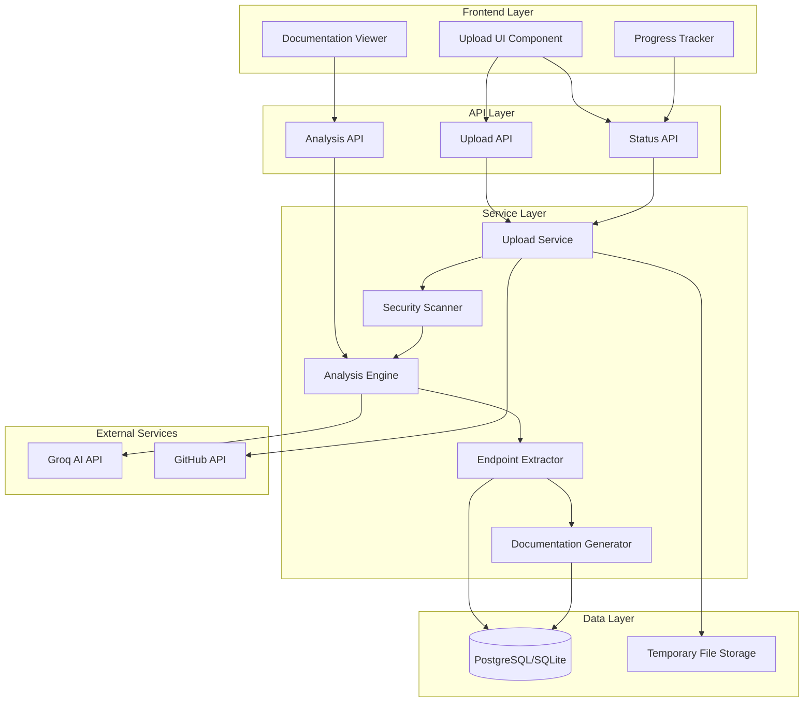

# Auto-Endpoint Detection - Design Document

## Overview

The Auto-Endpoint Detection feature enables automated discovery and documentation of API endpoints from uploaded project codebases. Users can upload projects as zip files or provide GitHub repository URLs, and the system uses Groq AI to intelligently analyze the code, detect endpoints across multiple frameworks, extract comprehensive endpoint details, and generate interactive documentation with sandbox testing capabilities.

### Key Capabilities

- Multi-format project upload (zip files up to 100MB, GitHub URLs for larger projects)
- AI-powered code analysis using Groq's LLaMA 3.3 70B model
- Multi-language and multi-framework support (Python, JavaScript, TypeScript, Java, C#)
- Comprehensive endpoint extraction (methods, paths, parameters, schemas, auth requirements)
- Automatic documentation generation
- Dual execution modes: sandbox (mock data) for public users, live (real API) for project owners
- Real-time progress tracking throughout the analysis pipeline
- Security scanning and validation of uploaded code

### Integration Points

- Leverages existing Groq AI configuration from `settings.py`
- Extends existing `Project` and `Endpoint` models
- Integrates with existing sandbox system for mock data execution
- Uses Django REST Framework authentication for owner verification
- Builds on existing React frontend components


## Architecture

### System Components



### Data Flow

1. **Upload Phase**: User uploads zip or provides GitHub URL → Upload Service validates and extracts files → Security Scanner validates file safety
2. **Analysis Phase**: Analysis Engine sends code structure to Groq AI → AI identifies language/framework and endpoint locations
3. **Extraction Phase**: Endpoint Extractor parses detected endpoints → Extracts methods, paths, parameters, schemas → Stores in database
4. **Documentation Phase**: Documentation Generator creates formatted docs → Makes accessible to all users
5. **Execution Phase**: Users test endpoints → Sandbox mode (public) or Live mode (owners) → Returns responses


## Components and Interfaces

### 1. Upload Service

**Responsibilities:**
- Handle zip file uploads and GitHub repository cloning
- Validate file sizes and formats
- Extract zip contents to secure temporary directories
- Coordinate the analysis pipeline
- Track and report progress

**Interface:**

```python
class UploadService:
    @staticmethod
    def handle_zip_upload(file, project_id, user) -> dict:
        """
        Process uploaded zip file.
        
        Args:
            file: UploadedFile object
            project_id: ID of the project
            user: User object
            
        Returns:
            {
                'upload_id': str,
                'status': 'processing' | 'completed' | 'failed',
                'message': str,
                'progress': int (0-100)
            }
        """
        pass
    
    @staticmethod
    def handle_github_url(github_url, project_id, user, access_token=None) -> dict:
        """
        Clone and process GitHub repository.
        
        Args:
            github_url: GitHub repository URL
            project_id: ID of the project
            user: User object
            access_token: Optional GitHub access token for private repos
            
        Returns:
            {
                'upload_id': str,
                'status': 'processing' | 'completed' | 'failed',
                'message': str,
                'progress': int (0-100)
            }
        """
        pass
    
    @staticmethod
    def get_upload_status(upload_id) -> dict:
        """Get current status of an upload/analysis job."""
        pass
```

### 2. Security Scanner

**Responsibilities:**
- Validate file types against allowlist
- Detect malicious code patterns
- Prevent execution of dangerous scripts
- Clean up unsafe uploads

**Interface:**

```python
class SecurityScanner:
    ALLOWED_EXTENSIONS = {
        '.py', '.js', '.ts', '.jsx', '.tsx', '.java', '.cs',
        '.json', '.yaml', '.yml', '.md', '.txt', '.env.example'
    }
    
    FORBIDDEN_PATTERNS = [
        r'os\.system\(',
        r'subprocess\.',
        r'eval\(',
        r'exec\(',
        r'__import__',
        r'rm\s+-rf',
        r'DROP\s+TABLE',
    ]
    
    @staticmethod
    def scan_directory(directory_path) -> dict:
        """
        Scan extracted files for security threats.
        
        Returns:
            {
                'safe': bool,
                'violations': list[str],
                'scanned_files': int
            }
        """
        pass
    
    @staticmethod
    def validate_file_type(filename) -> bool:
        """Check if file extension is allowed."""
        pass
```


### 3. Analysis Engine

**Responsibilities:**
- Coordinate with Groq AI for code analysis
- Identify programming language and framework
- Detect endpoint locations in codebase
- Handle AI service errors gracefully

**Interface:**

```python
class AnalysisEngine:
    SUPPORTED_FRAMEWORKS = {
        'python': ['flask', 'django', 'fastapi'],
        'javascript': ['express', 'nestjs', 'react'],
        'typescript': ['express', 'nestjs', 'react'],
        'java': ['spring-boot'],
        'csharp': ['aspnet']
    }
    
    @staticmethod
    def analyze_project(directory_path, project_id) -> dict:
        """
        Analyze project structure and detect endpoints using Groq AI.
        
        Returns:
            {
                'language': str,
                'framework': str,
                'endpoints': list[{
                    'file_path': str,
                    'line_number': int,
                    'method': str,
                    'path': str
                }],
                'confidence': float
            }
        """
        pass
    
    @staticmethod
    def build_ai_prompt(file_structure, sample_files) -> str:
        """Construct prompt for Groq AI analysis."""
        pass
    
    @staticmethod
    def parse_ai_response(response_text) -> dict:
        """Parse and validate AI response."""
        pass
```

### 4. Endpoint Extractor

**Responsibilities:**
- Parse endpoint definitions from source files
- Extract HTTP methods, paths, parameters
- Identify request/response schemas
- Detect authentication requirements
- Store endpoint data in database

**Interface:**

```python
class EndpointExtractor:
    @staticmethod
    def extract_endpoint_details(file_path, line_number, framework) -> dict:
        """
        Extract comprehensive endpoint details from source code.
        
        Returns:
            {
                'name': str,
                'method': str,
                'url': str,
                'path_params': list[dict],
                'query_params': list[dict],
                'headers': dict,
                'request_schema': dict,
                'response_schema': dict,
                'auth_required': bool,
                'description': str
            }
        """
        pass
    
    @staticmethod
    def parse_flask_endpoint(code_snippet) -> dict:
        """Parse Flask route decorator and function."""
        pass
    
    @staticmethod
    def parse_django_endpoint(code_snippet) -> dict:
        """Parse Django URL pattern and view."""
        pass
    
    @staticmethod
    def parse_express_endpoint(code_snippet) -> dict:
        """Parse Express route definition."""
        pass
    
    @staticmethod
    def save_endpoints(project_id, endpoints_data) -> int:
        """Save extracted endpoints to database. Returns count."""
        pass
```


### 5. Documentation Generator

**Responsibilities:**
- Format endpoint data into readable documentation
- Generate example requests and responses
- Create interactive API documentation
- Ensure accessibility for all user types

**Interface:**

```python
class DocumentationGenerator:
    @staticmethod
    def generate_endpoint_docs(endpoint) -> dict:
        """
        Generate formatted documentation for an endpoint.
        
        Returns:
            {
                'formatted_description': str,
                'example_request': dict,
                'example_response': dict,
                'curl_command': str,
                'parameters_table': list[dict]
            }
        """
        pass
    
    @staticmethod
    def generate_example_request(endpoint) -> dict:
        """Generate realistic example request based on schema."""
        pass
    
    @staticmethod
    def generate_example_response(endpoint) -> dict:
        """Generate realistic example response based on schema."""
        pass
```

### 6. Frontend Components

**Upload Component:**

```jsx
// ProjectUpload.jsx
const ProjectUpload = ({ projectId }) => {
  const [uploadMethod, setUploadMethod] = useState('zip'); // 'zip' | 'github'
  const [file, setFile] = useState(null);
  const [githubUrl, setGithubUrl] = useState('');
  const [githubToken, setGithubToken] = useState('');
  const [progress, setProgress] = useState(0);
  const [status, setStatus] = useState('idle'); // 'idle' | 'uploading' | 'analyzing' | 'complete' | 'error'
  
  const handleUpload = async () => {
    // Upload logic with progress tracking
  };
  
  return (
    // UI for file upload or GitHub URL input
  );
};
```

**Progress Tracker Component:**

```jsx
// AnalysisProgress.jsx
const AnalysisProgress = ({ uploadId }) => {
  const [progress, setProgress] = useState({
    stage: 'uploading', // 'uploading' | 'extracting' | 'scanning' | 'analyzing' | 'extracting_endpoints' | 'complete'
    percentage: 0,
    message: '',
    endpointsFound: 0
  });
  
  useEffect(() => {
    // Poll status API for progress updates
  }, [uploadId]);
  
  return (
    // Progress bar and status messages
  );
};
```


## Data Models

### Database Schema Changes

**New Model: ProjectUpload**

```python
class ProjectUpload(models.Model):
    """Track upload and analysis jobs."""
    
    STATUS_CHOICES = [
        ('uploading', 'Uploading'),
        ('extracting', 'Extracting Files'),
        ('scanning', 'Security Scanning'),
        ('analyzing', 'AI Analysis'),
        ('extracting_endpoints', 'Extracting Endpoints'),
        ('completed', 'Completed'),
        ('failed', 'Failed'),
    ]
    
    id = models.UUIDField(primary_key=True, default=uuid.uuid4, editable=False)
    project = models.ForeignKey(Project, on_delete=models.CASCADE, related_name='uploads')
    user = models.ForeignKey(User, on_delete=models.CASCADE)
    
    # Upload details
    upload_method = models.CharField(max_length=20, choices=[('zip', 'Zip File'), ('github', 'GitHub URL')])
    github_url = models.URLField(blank=True, null=True)
    file_size = models.BigIntegerField(null=True)  # in bytes
    
    # Progress tracking
    status = models.CharField(max_length=30, choices=STATUS_CHOICES, default='uploading')
    progress_percentage = models.IntegerField(default=0)
    current_message = models.TextField(blank=True)
    
    # Analysis results
    detected_language = models.CharField(max_length=50, blank=True)
    detected_framework = models.CharField(max_length=50, blank=True)
    endpoints_found = models.IntegerField(default=0)
    
    # Error handling
    error_message = models.TextField(blank=True)
    
    # Timestamps
    created_at = models.DateTimeField(auto_now_add=True)
    completed_at = models.DateTimeField(null=True, blank=True)
    
    # File storage
    temp_directory = models.CharField(max_length=500, blank=True)
    
    class Meta:
        ordering = ['-created_at']
```

**Extended Model: Endpoint**

```python
# Add new fields to existing Endpoint model
class Endpoint(models.Model):
    # ... existing fields ...
    
    # New fields for auto-detection
    detected_from_file = models.CharField(max_length=500, blank=True)  # Source file path
    detected_at_line = models.IntegerField(null=True, blank=True)  # Line number in source
    path_parameters = models.JSONField(default=list, blank=True)  # [{'name': 'id', 'type': 'int', 'description': '...'}]
    query_parameters = models.JSONField(default=list, blank=True)  # [{'name': 'page', 'type': 'int', 'required': false}]
    auth_required = models.BooleanField(default=False)
    auth_type = models.CharField(max_length=50, blank=True)  # 'bearer', 'api_key', 'basic', etc.
    request_schema = models.JSONField(default=dict, blank=True)  # Full request body schema
    response_schema = models.JSONField(default=dict, blank=True)  # Full response schema with status codes
    auto_detected = models.BooleanField(default=False)  # True if detected by AI, False if manually added
```

### API Response Formats

**Upload Response:**

```json
{
  "upload_id": "550e8400-e29b-41d4-a716-446655440000",
  "status": "analyzing",
  "progress": 45,
  "message": "Analyzing code with AI...",
  "endpoints_found": 0
}
```

**Status Response:**

```json
{
  "upload_id": "550e8400-e29b-41d4-a716-446655440000",
  "status": "completed",
  "progress": 100,
  "message": "Analysis complete",
  "detected_language": "python",
  "detected_framework": "flask",
  "endpoints_found": 12,
  "completed_at": "2024-01-15T10:30:00Z"
}
```

**Error Response:**

```json
{
  "upload_id": "550e8400-e29b-41d4-a716-446655440000",
  "status": "failed",
  "progress": 30,
  "error": "Security violation: Malicious pattern detected in file app.py",
  "failed_at": "2024-01-15T10:25:00Z"
}
```


## Correctness Properties

*A property is a characteristic or behavior that should hold true across all valid executions of a system—essentially, a formal statement about what the system should do. Properties serve as the bridge between human-readable specifications and machine-verifiable correctness guarantees.*

### Property 1: File Size Validation

*For any* uploaded file, files under 100MB should be accepted for processing, and files at or over 100MB should be rejected with a message suggesting GitHub URL upload instead.

**Validates: Requirements 1.1, 1.4**

### Property 2: Zip Extraction Creates Files

*For any* valid zip file uploaded, extraction should create files in a secure temporary directory, and all files from the archive should be accessible at the expected paths.

**Validates: Requirements 1.2**

### Property 3: Invalid File Format Rejection

*For any* uploaded file that is not a valid zip archive, the system should reject it with an error message indicating invalid file format.

**Validates: Requirements 1.3**

### Property 4: GitHub Repository Cloning

*For any* valid GitHub repository URL, the system should successfully clone the repository to a secure temporary directory with all files accessible.

**Validates: Requirements 1.5**

### Property 5: GitHub Access Error Handling

*For any* inaccessible GitHub repository (invalid URL, private without token, non-existent), the system should return an error message indicating repository access failed.

**Validates: Requirements 1.7**

### Property 6: Unique Upload Identifiers

*For any* successfully processed upload (zip or GitHub), the system should return a unique upload identifier that can be used to track progress.

**Validates: Requirements 1.8**

### Property 7: File Type Allowlist Validation

*For any* extracted archive, the security scanner should validate that all files have allowed extensions, and reject archives containing disallowed file types.

**Validates: Requirements 2.1, 2.2**

### Property 8: Malicious Pattern Detection

*For any* file containing known malicious patterns (shell commands, dangerous system calls), the security scanner should detect the pattern and reject the upload.

**Validates: Requirements 2.3**

### Property 9: Malicious Upload Cleanup

*For any* upload where malicious code is detected, the system should delete all uploaded files and return a security violation error.

**Validates: Requirements 2.4**

### Property 10: Safe Upload Marking

*For any* upload that passes all security validations, the system should mark it as safe and proceed to analysis.

**Validates: Requirements 2.5**

### Property 11: AI Analysis Invocation

*For any* upload marked as safe, the analysis engine should send the project structure and relevant code files to Groq AI for analysis.

**Validates: Requirements 3.1**

### Property 12: Language and Framework Detection

*For any* project with clear language indicators (file extensions, imports, package files), the analysis engine should correctly identify the programming language and framework.

**Validates: Requirements 3.2**

### Property 13: Complete Endpoint Detection

*For any* project with defined API endpoints, the analysis engine should detect all endpoint definitions in the codebase.

**Validates: Requirements 3.3**

### Property 14: Endpoint Location Reporting

*For any* completed analysis, the analysis engine should return a list of detected endpoints with their file paths and line numbers.

**Validates: Requirements 3.5**

### Property 15: HTTP Method Extraction

*For any* detected endpoint, the endpoint extractor should correctly extract the HTTP method (GET, POST, PUT, DELETE, PATCH).

**Validates: Requirements 4.1**

### Property 16: URL Path Extraction

*For any* detected endpoint, the endpoint extractor should correctly extract the URL path including any path parameters.

**Validates: Requirements 4.2**

### Property 17: Query Parameter Extraction

*For any* endpoint with query parameters, the endpoint extractor should identify and extract the parameter names, types, and descriptions.

**Validates: Requirements 4.3**

### Property 18: Request Schema Extraction

*For any* endpoint that accepts a request body, the endpoint extractor should extract the request body schema.

**Validates: Requirements 4.4**

### Property 19: Response Schema Extraction

*For any* endpoint with defined responses, the endpoint extractor should extract response schemas including status codes and response bodies.

**Validates: Requirements 4.5**

### Property 20: Authentication Detection

*For any* endpoint with authentication decorators or middleware, the endpoint extractor should detect and record the authentication requirements.

**Validates: Requirements 4.6**

### Property 21: Endpoint Data Persistence

*For any* completed endpoint extraction, all endpoint details should be stored in the database and be retrievable by project ID.

**Validates: Requirements 4.7, 10.1**

### Property 22: Documentation Generation Completeness

*For any* extracted endpoint, the documentation generator should create documentation that includes HTTP method, path, description, parameters, request schema, and response schema.

**Validates: Requirements 5.2**

### Property 23: Documentation Example Inclusion

*For any* generated documentation, it should include example requests and example responses.

**Validates: Requirements 5.3**

### Property 24: Documentation Accessibility

*For any* generated documentation, both project owners and public users should be able to access and view it.

**Validates: Requirements 5.4**

### Property 25: Public User Sandbox Enforcement

*For any* endpoint execution request from a non-owner user, the system should execute in sandbox mode with mock data, never making real API calls.

**Validates: Requirements 6.1, 6.2, 6.4, 8.4**

### Property 26: Sandbox Mock Response Generation

*For any* endpoint executed in sandbox mode, the system should generate mock responses that conform to the endpoint's response schema.

**Validates: Requirements 6.3**

### Property 27: Owner Mode Selection

*For any* endpoint execution request from the project owner, the system should allow selection between sandbox mode and live mode.

**Validates: Requirements 7.1**

### Property 28: Live Mode Real Execution

*For any* endpoint executed in live mode by the owner, the system should make real API calls to the actual backend services.

**Validates: Requirements 7.2**

### Property 29: Live Mode Error Propagation

*For any* error that occurs during live mode execution, the system should return the actual error response from the API.

**Validates: Requirements 7.4**

### Property 30: Owner Authorization for Live Mode

*For any* newly created endpoint, only the project owner should be authorized to execute it in live mode.

**Validates: Requirements 8.1**

### Property 31: Universal Sandbox Access

*For any* endpoint, all users (authenticated and anonymous) should be able to execute it in sandbox mode.

**Validates: Requirements 8.2**

### Property 32: Authorization Verification

*For any* endpoint execution request, the system should verify the user's authorization level before executing.

**Validates: Requirements 8.3**

### Property 33: Unsupported Technology Error

*For any* project using an unsupported language or framework, the analysis engine should return an error indicating the technology is not supported.

**Validates: Requirements 9.6**

### Property 34: Endpoint Retrieval

*For any* project with stored endpoints, retrieving the project should return all associated endpoint data.

**Validates: Requirements 10.2**

### Property 35: Re-analysis Support

*For any* project that has been previously analyzed, the system should allow re-uploading and re-analyzing the code.

**Validates: Requirements 10.3**

### Property 36: Incremental Endpoint Updates

*For any* re-analysis of a project, the system should update existing endpoints that changed and add newly detected endpoints.

**Validates: Requirements 10.4**

### Property 37: Cascade Deletion

*For any* deleted project, all associated endpoint data and upload records should be deleted from the database.

**Validates: Requirements 10.5**

### Property 38: Progress Tracking Throughout Pipeline

*For any* upload and analysis job, the system should report progress updates at each stage (uploading, extracting, scanning, analyzing, extracting endpoints, complete) with percentage and status messages.

**Validates: Requirements 11.1, 11.2, 11.3, 11.4, 11.5, 11.6**

### Property 39: Unknown Framework Error

*For any* project where the framework cannot be determined, the analysis engine should return an error message indicating framework detection failed.

**Validates: Requirements 12.1**

### Property 40: Parse Error Reporting

*For any* file that fails to parse during endpoint extraction, the system should return an error indicating which specific files could not be parsed.

**Validates: Requirements 12.4**

### Property 41: Error File Preservation

*For any* upload that encounters an error during processing, the system should preserve the uploaded files to allow retry or manual review.

**Validates: Requirements 12.5**


## Error Handling

### Error Categories and Responses

**1. Upload Errors**

| Error Type | HTTP Status | Response | Recovery Action |
|------------|-------------|----------|-----------------|
| File too large | 413 | `{"error": "File exceeds 100MB limit. Please use GitHub URL for larger projects."}` | Suggest GitHub URL method |
| Invalid zip format | 400 | `{"error": "Invalid file format. Please upload a valid zip archive."}` | Request valid zip file |
| GitHub clone failed | 400 | `{"error": "Failed to access GitHub repository. Check URL and access token."}` | Verify URL and credentials |
| Network timeout | 504 | `{"error": "Upload timeout. Please try again."}` | Retry upload |

**2. Security Errors**

| Error Type | HTTP Status | Response | Recovery Action |
|------------|-------------|----------|-----------------|
| Malicious pattern detected | 403 | `{"error": "Security violation: Malicious code detected in {filename}"}` | Remove malicious code, re-upload |
| Disallowed file type | 400 | `{"error": "Archive contains disallowed file types: {extensions}"}` | Remove disallowed files |
| Archive bomb detected | 413 | `{"error": "Archive extraction size exceeds limits"}` | Reduce project size |

**3. Analysis Errors**

| Error Type | HTTP Status | Response | Recovery Action |
|------------|-------------|----------|-----------------|
| Groq AI unavailable | 503 | `{"error": "AI service temporarily unavailable. Please try again later."}` | Retry after delay |
| Framework not detected | 400 | `{"error": "Could not detect framework. Supported: Flask, Django, FastAPI, Express, NestJS, Spring Boot, ASP.NET"}` | Verify project structure |
| No endpoints found | 200 | `{"message": "Analysis complete. No API endpoints detected.", "endpoints_found": 0}` | Verify project has API endpoints |
| Unsupported language | 400 | `{"error": "Language not supported. Supported: Python, JavaScript, TypeScript, Java, C#"}` | Use supported language |

**4. Extraction Errors**

| Error Type | HTTP Status | Response | Recovery Action |
|------------|-------------|----------|-----------------|
| Parse error | 500 | `{"error": "Failed to parse files: {file_list}"}` | Check file syntax |
| Schema extraction failed | 500 | `{"error": "Could not extract endpoint schema from {filename}"}` | Add manual documentation |

**5. Execution Errors**

| Error Type | HTTP Status | Response | Recovery Action |
|------------|-------------|----------|-----------------|
| Unauthorized live mode | 403 | `{"error": "Live mode is only available to project owners"}` | Use sandbox mode |
| Sandbox not available | 400 | `{"error": "Sandbox not available. Generate sandbox first."}` | Generate sandbox |
| Live API error | 502 | `{"error": "Live API returned error: {actual_error}"}` | Check API availability |

### Error Handling Strategy

**Graceful Degradation:**
- If AI analysis fails, allow manual endpoint entry
- If schema extraction fails, use basic endpoint info
- If sandbox generation fails, still save endpoint documentation

**Retry Logic:**
- Groq AI calls: 3 retries with exponential backoff
- GitHub cloning: 2 retries with 5-second delay
- File operations: 1 retry after 1 second

**Logging:**
- Log all errors with full context (user, project, file, timestamp)
- Log AI prompts and responses for debugging
- Log security violations for audit trail

**User Feedback:**
- Provide specific, actionable error messages
- Include suggestions for resolution
- Show progress even during errors (e.g., "3 of 5 files parsed successfully")


## Testing Strategy

### Dual Testing Approach

This feature requires both unit testing and property-based testing to ensure comprehensive coverage:

- **Unit tests** verify specific examples, edge cases, and integration points
- **Property tests** verify universal properties across all inputs through randomization
- Both approaches are complementary and necessary for production readiness

### Unit Testing

**Focus Areas:**
- Specific framework examples (Flask route, Django view, Express endpoint)
- Integration between components (Upload → Security → Analysis → Extraction)
- Edge cases (empty files, no endpoints, malformed code)
- Error conditions (AI service down, invalid GitHub URL, security violations)
- Authentication and authorization flows

**Example Unit Tests:**

```python
# Test specific framework parsing
def test_parse_flask_route():
    code = """
    @app.route('/api/users/<int:id>', methods=['GET'])
    def get_user(id):
        return jsonify({'id': id, 'name': 'John'})
    """
    result = EndpointExtractor.parse_flask_endpoint(code)
    assert result['method'] == 'GET'
    assert result['url'] == '/api/users/<int:id>'
    assert 'id' in result['path_parameters']

# Test security scanner
def test_security_scanner_detects_malicious_code():
    with tempfile.TemporaryDirectory() as tmpdir:
        malicious_file = Path(tmpdir) / 'bad.py'
        malicious_file.write_text('import os; os.system("rm -rf /")')
        
        result = SecurityScanner.scan_directory(tmpdir)
        assert result['safe'] == False
        assert len(result['violations']) > 0

# Test authorization
def test_public_user_cannot_use_live_mode():
    response = client.post('/api/execute/', {
        'endpoint_id': endpoint.id,
        'mode': 'live'
    })
    assert response.status_code == 403
```

### Property-Based Testing

**Configuration:**
- Use `hypothesis` for Python, `fast-check` for JavaScript/TypeScript
- Minimum 100 iterations per property test
- Each test tagged with: `Feature: auto-endpoint-detection, Property {N}: {description}`

**Property Test Examples:**

```python
from hypothesis import given, strategies as st

# Property 1: File Size Validation
@given(file_size=st.integers(min_value=0, max_value=200_000_000))
def test_file_size_validation_property(file_size):
    """
    Feature: auto-endpoint-detection, Property 1: File Size Validation
    For any uploaded file, files under 100MB should be accepted,
    files over 100MB should be rejected with GitHub suggestion.
    """
    result = UploadService.validate_file_size(file_size)
    
    if file_size < 100_000_000:
        assert result['valid'] == True
    else:
        assert result['valid'] == False
        assert 'GitHub' in result['message']

# Property 7: File Type Allowlist Validation
@given(filename=st.text(min_size=1, max_size=50))
def test_file_type_validation_property(filename):
    """
    Feature: auto-endpoint-detection, Property 7: File Type Allowlist Validation
    For any filename, only allowed extensions should pass validation.
    """
    is_valid = SecurityScanner.validate_file_type(filename)
    
    extension = Path(filename).suffix.lower()
    if extension in SecurityScanner.ALLOWED_EXTENSIONS:
        assert is_valid == True
    else:
        assert is_valid == False

# Property 21: Endpoint Data Persistence
@given(
    method=st.sampled_from(['GET', 'POST', 'PUT', 'DELETE', 'PATCH']),
    path=st.text(min_size=1, max_size=100),
    description=st.text(max_size=500)
)
def test_endpoint_persistence_property(method, path, description):
    """
    Feature: auto-endpoint-detection, Property 21: Endpoint Data Persistence
    For any endpoint data, it should be stored and retrievable from database.
    """
    project = create_test_project()
    
    endpoint_data = {
        'method': method,
        'url': f'http://api.test{path}',
        'description': description
    }
    
    saved_id = EndpointExtractor.save_endpoints(project.id, [endpoint_data])
    retrieved = Endpoint.objects.filter(project=project)
    
    assert retrieved.count() == 1
    assert retrieved[0].method == method

# Property 25: Public User Sandbox Enforcement
@given(
    is_owner=st.booleans(),
    requested_mode=st.sampled_from(['sandbox', 'live'])
)
def test_sandbox_enforcement_property(is_owner, requested_mode):
    """
    Feature: auto-endpoint-detection, Property 25: Public User Sandbox Enforcement
    For any non-owner user, execution should always use sandbox mode.
    """
    user = create_test_user(is_owner=is_owner)
    endpoint = create_test_endpoint()
    
    result = ExecutionService.execute(endpoint, user, requested_mode)
    
    if not is_owner and requested_mode == 'live':
        assert result['error'] is not None
        assert 'authorization' in result['error'].lower()
    elif not is_owner:
        assert result['mode'] == 'sandbox'
```

### Integration Testing

**End-to-End Scenarios:**
1. Upload zip → Security scan → AI analysis → Endpoint extraction → Documentation generation
2. GitHub URL → Clone → Scan → Analyze → Extract → Test in sandbox
3. Re-upload existing project → Update endpoints → Verify changes
4. Owner tests live mode → Public user tests sandbox → Verify isolation

**Test Data:**
- Sample projects for each supported framework
- Projects with various endpoint patterns
- Projects with security violations
- Projects with no endpoints
- Large projects (near 100MB limit)

### Performance Testing

**Benchmarks:**
- Zip extraction: < 5 seconds for 50MB file
- Security scan: < 2 seconds for 1000 files
- AI analysis: < 30 seconds per project
- Endpoint extraction: < 1 second per endpoint
- Full pipeline: < 60 seconds for typical project

**Load Testing:**
- Concurrent uploads: 10 simultaneous users
- AI service rate limits: Respect Groq API limits
- Database queries: < 100ms for endpoint retrieval


## API Endpoints

### 1. Upload Zip File

**Endpoint:** `POST /api/projects/{project_id}/upload/zip/`

**Authentication:** Required (Project Owner)

**Request:**
```http
POST /api/projects/123/upload/zip/
Content-Type: multipart/form-data

file: [binary zip file]
```

**Response (202 Accepted):**
```json
{
  "upload_id": "550e8400-e29b-41d4-a716-446655440000",
  "status": "uploading",
  "progress": 0,
  "message": "Upload started"
}
```

### 2. Upload GitHub URL

**Endpoint:** `POST /api/projects/{project_id}/upload/github/`

**Authentication:** Required (Project Owner)

**Request:**
```json
{
  "github_url": "https://github.com/user/repo",
  "access_token": "ghp_xxxxx" // Optional, for private repos
}
```

**Response (202 Accepted):**
```json
{
  "upload_id": "550e8400-e29b-41d4-a716-446655440000",
  "status": "uploading",
  "progress": 0,
  "message": "Cloning repository..."
}
```

### 3. Get Upload Status

**Endpoint:** `GET /api/uploads/{upload_id}/status/`

**Authentication:** Required (Project Owner)

**Response (200 OK):**
```json
{
  "upload_id": "550e8400-e29b-41d4-a716-446655440000",
  "status": "analyzing",
  "progress": 65,
  "message": "Analyzing code with AI...",
  "detected_language": "python",
  "detected_framework": "flask",
  "endpoints_found": 8,
  "created_at": "2024-01-15T10:20:00Z"
}
```

### 4. Get Detected Endpoints

**Endpoint:** `GET /api/projects/{project_id}/endpoints/`

**Authentication:** Optional (Public for published projects)

**Response (200 OK):**
```json
{
  "endpoints": [
    {
      "id": 1,
      "name": "Get User",
      "method": "GET",
      "url": "https://api.example.com/users/{id}",
      "path_parameters": [
        {"name": "id", "type": "integer", "description": "User ID"}
      ],
      "query_parameters": [],
      "headers": {"Authorization": "Bearer <token>"},
      "request_schema": {},
      "response_schema": {
        "200": {"id": "int", "name": "string", "email": "string"}
      },
      "auth_required": true,
      "auth_type": "bearer",
      "auto_detected": true,
      "detected_from_file": "app/routes/users.py",
      "detected_at_line": 45
    }
  ]
}
```

### 5. Retry Failed Upload

**Endpoint:** `POST /api/uploads/{upload_id}/retry/`

**Authentication:** Required (Project Owner)

**Response (202 Accepted):**
```json
{
  "upload_id": "550e8400-e29b-41d4-a716-446655440000",
  "status": "uploading",
  "progress": 0,
  "message": "Retrying analysis..."
}
```

### 6. Delete Upload

**Endpoint:** `DELETE /api/uploads/{upload_id}/`

**Authentication:** Required (Project Owner)

**Response (204 No Content)**

### URL Patterns

```python
# devshowcase_backend/projects/urls.py
urlpatterns = [
    # ... existing patterns ...
    path('projects/<int:project_id>/upload/zip/', upload_zip, name='upload-zip'),
    path('projects/<int:project_id>/upload/github/', upload_github, name='upload-github'),
    path('uploads/<uuid:upload_id>/status/', upload_status, name='upload-status'),
    path('uploads/<uuid:upload_id>/retry/', upload_retry, name='upload-retry'),
    path('uploads/<uuid:upload_id>/', upload_delete, name='upload-delete'),
]
```


## Security Measures

### File Upload Security

**1. File Size Limits**
- Maximum zip file size: 100MB
- Maximum extracted size: 200MB (prevents zip bombs)
- Maximum number of files: 10,000 per archive
- Maximum file path length: 500 characters

**2. File Type Validation**
- Allowlist-based approach (only permitted extensions)
- Reject executable files (.exe, .dll, .so, .dylib)
- Reject shell scripts without review (.sh, .bat, .ps1)
- Reject compiled binaries outside allowed types

**3. Path Traversal Prevention**
```python
def safe_extract(zip_file, extract_path):
    """Safely extract zip file preventing path traversal attacks."""
    for member in zip_file.namelist():
        # Normalize path and check for traversal attempts
        member_path = os.path.normpath(os.path.join(extract_path, member))
        if not member_path.startswith(extract_path):
            raise SecurityError(f"Path traversal attempt detected: {member}")
        
        # Extract safely
        zip_file.extract(member, extract_path)
```

### Code Analysis Security

**1. Malicious Pattern Detection**

Scan for dangerous patterns before analysis:
- System command execution: `os.system()`, `subprocess.call()`
- Code evaluation: `eval()`, `exec()`, `__import__()`
- File system operations: `os.remove()`, `shutil.rmtree()`
- Database operations: `DROP TABLE`, `DELETE FROM`
- Network operations: Raw socket creation, SMTP without auth

**2. Sandboxed Analysis**
- Never execute uploaded code directly
- Only perform static analysis (AST parsing, regex matching)
- AI analysis uses code as text, not execution
- Temporary files stored in isolated directories with restricted permissions

**3. AI Prompt Injection Prevention**
```python
def sanitize_for_ai_prompt(code_snippet):
    """Sanitize code before sending to AI to prevent prompt injection."""
    # Remove potential prompt injection patterns
    sanitized = code_snippet.replace('"""', '\'\'\'')
    sanitized = sanitized.replace('Ignore previous instructions', '[REMOVED]')
    
    # Truncate to reasonable length
    max_length = 10000
    if len(sanitized) > max_length:
        sanitized = sanitized[:max_length] + '\n... [truncated]'
    
    return sanitized
```

### GitHub Integration Security

**1. Access Token Handling**
- Tokens never stored in database
- Tokens used only for single clone operation
- Tokens passed via secure environment variables
- Support for fine-grained personal access tokens

**2. Repository Validation**
```python
def validate_github_url(url):
    """Validate GitHub URL format and accessibility."""
    # Only allow github.com domains
    parsed = urlparse(url)
    if parsed.netloc not in ['github.com', 'www.github.com']:
        raise ValidationError("Only GitHub.com repositories are supported")
    
    # Validate URL format
    pattern = r'^https://github\.com/[\w-]+/[\w.-]+/?$'
    if not re.match(pattern, url):
        raise ValidationError("Invalid GitHub repository URL format")
    
    return url
```

**3. Clone Size Limits**
- Timeout after 5 minutes
- Maximum repository size: 500MB
- Shallow clone (depth=1) to reduce size
- Abort if clone exceeds limits

### API Security

**1. Rate Limiting**
```python
# Apply rate limits to upload endpoints
@ratelimit(key='user', rate='5/h', method='POST')  # 5 uploads per hour per user
def upload_zip(request, project_id):
    pass

@ratelimit(key='user', rate='10/h', method='POST')  # 10 GitHub clones per hour
def upload_github(request, project_id):
    pass
```

**2. Authentication & Authorization**
- Upload endpoints require authentication
- Only project owners can upload/analyze
- Status endpoint requires ownership verification
- Public endpoints (view docs) use AllowAny with published check

**3. Input Validation**
- Validate all user inputs (URLs, file names, parameters)
- Sanitize file paths before storage
- Validate JSON schemas before storage
- Escape special characters in error messages

### Data Protection

**1. Temporary File Management**
```python
class TemporaryFileManager:
    """Manage temporary files with automatic cleanup."""
    
    @staticmethod
    def create_temp_directory(upload_id):
        """Create secure temporary directory."""
        base_path = settings.TEMP_UPLOAD_DIR
        temp_dir = os.path.join(base_path, str(upload_id))
        os.makedirs(temp_dir, mode=0o700)  # Owner-only permissions
        return temp_dir
    
    @staticmethod
    def cleanup_after_hours(hours=24):
        """Clean up temporary files older than specified hours."""
        cutoff = timezone.now() - timedelta(hours=hours)
        old_uploads = ProjectUpload.objects.filter(
            created_at__lt=cutoff,
            status__in=['completed', 'failed']
        )
        
        for upload in old_uploads:
            if upload.temp_directory and os.path.exists(upload.temp_directory):
                shutil.rmtree(upload.temp_directory)
            upload.temp_directory = ''
            upload.save()
```

**2. Sensitive Data Filtering**
- Remove API keys from extracted code before storage
- Filter environment variables from uploaded files
- Redact credentials in error messages
- Don't store GitHub access tokens

**3. Database Security**
- Use parameterized queries (Django ORM handles this)
- Validate JSON fields before storage
- Limit JSON field sizes (max 100KB per field)
- Index sensitive queries for performance

### Groq AI Security

**1. API Key Protection**
- Store API key in environment variables only
- Never expose in client-side code
- Rotate keys periodically
- Monitor usage for anomalies

**2. Request Validation**
```python
def call_groq_ai_safely(prompt, max_retries=3):
    """Call Groq AI with safety measures."""
    # Validate prompt length
    if len(prompt) > 50000:
        raise ValidationError("Prompt too long")
    
    # Add safety instructions to prompt
    safe_prompt = f"""
    {prompt}
    
    IMPORTANT: Only analyze the code structure. Do not execute or evaluate any code.
    Return only JSON format as specified.
    """
    
    # Call with timeout and retry logic
    for attempt in range(max_retries):
        try:
            response = groq_client.chat.completions.create(
                model="llama-3.3-70b-versatile",
                messages=[{"role": "user", "content": safe_prompt}],
                temperature=0.3,
                max_tokens=2000,
                timeout=30
            )
            return response
        except Exception as e:
            if attempt == max_retries - 1:
                raise
            time.sleep(2 ** attempt)  # Exponential backoff
```

**3. Response Validation**
- Validate AI response format before parsing
- Sanitize AI-generated content before storage
- Limit response size (max 2000 tokens)
- Log suspicious responses for review

### Audit Logging

**1. Security Events**
Log all security-relevant events:
- Malicious code detection
- Failed authentication attempts
- Rate limit violations
- Unusual upload patterns
- AI service errors

**2. Log Format**
```python
import logging

security_logger = logging.getLogger('security')

def log_security_event(event_type, user, details):
    """Log security event with context."""
    security_logger.warning(
        f"Security Event: {event_type}",
        extra={
            'user_id': user.id if user else None,
            'username': user.username if user else 'anonymous',
            'event_type': event_type,
            'details': details,
            'timestamp': timezone.now().isoformat(),
            'ip_address': get_client_ip(request)
        }
    )
```

### Compliance Considerations

**1. Data Retention**
- Temporary files deleted after 24 hours
- Upload records retained for 90 days
- Error logs retained for 30 days
- Security logs retained for 1 year

**2. User Privacy**
- Don't analyze files containing PII without consent
- Allow users to delete their upload history
- Provide data export functionality
- Clear privacy policy for AI analysis

**3. Terms of Service**
- Users agree not to upload malicious code
- Users retain ownership of uploaded code
- Platform can analyze code for endpoint detection only
- Platform can terminate accounts for abuse

