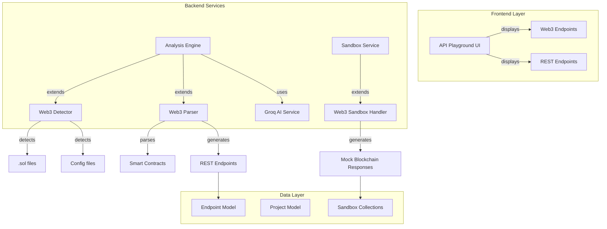

# Design Document: Web3 Smart Contract Support

## Overview

This design extends the DevShowcase platform's existing API analysis capabilities to support Web3 smart contract projects. The system will seamlessly integrate Web3 detection, parsing, and testing into the current architecture without breaking existing functionality.

The solution leverages the existing Analysis Engine's AI-powered approach, extending it to understand Solidity smart contracts and convert them into REST-like API endpoints. These endpoints will be testable in the existing API Playground with mock blockchain responses provided by the enhanced Sandbox Environment.

### Key Design Principles

- **Non-Breaking Extension**: All Web3 functionality extends existing systems without modifying core interfaces
- **AI-Powered Analysis**: Reuse existing Groq AI integration for smart contract parsing
- **Familiar Interface**: Present Web3 endpoints in the same UI as traditional APIs
- **Mock-First Testing**: Enable comprehensive testing without blockchain deployment
- **Rate Limit Awareness**: Respect Groq free tier constraints through intelligent batching

## Architecture

### High-Level Architecture



### Component Integration

The Web3 support integrates into existing components at specific extension points:

1. **Analysis Engine**: New Web3 detection logic in `_detect_language_and_framework()`
2. **AI Parsing**: Extended prompts and response parsing for Solidity contracts
3. **Sandbox Service**: New Web3-specific mock response generation
4. **API Playground**: Visual indicators for Web3 endpoints (no code changes needed)

## Components and Interfaces

### Web3 Project Detector

**Location**: `devshowcase_backend/projects/services/analysis_engine.py`

**Integration Point**: Extends `_detect_language_and_framework()` method

```python
def _detect_web3_project(self, directory_path):
    """Detect Web3 projects and determine framework type."""
    web3_indicators = {
        'files': ['.sol'],
        'configs': {
            'hardhat.config.js': 'hardhat',
            'truffle-config.js': 'truffle', 
            'foundry.toml': 'foundry'
        }
    }
    
    # Detection logic returns framework type and version
    return {
        'is_web3': bool,
        'framework': str,  # 'hardhat', 'truffle', 'foundry'
        'version': str,
        'contracts_dir': str
    }
```

### Web3 Contract Parser

**Location**: `devshowcase_backend/projects/services/web3_parser.py` (new file)

**Interface**: Follows same pattern as existing framework parsers

```python
class Web3ContractParser:
    def __init__(self, groq_client):
        self.groq_client = groq_client
        
    def parse_contracts(self, contract_files, framework_info):
        """Parse Solidity contracts and extract function signatures."""
        # Batch contracts to respect rate limits
        # Generate AI prompts for contract analysis
        # Parse AI responses into endpoint structures
        return parsed_endpoints
        
    def _build_solidity_prompt(self, contract_content, contract_name):
        """Build AI prompt for Solidity contract analysis."""
        # Specialized prompt for smart contract parsing
        
    def _parse_contract_response(self, ai_response, contract_name):
        """Parse AI response into endpoint data structures."""
        # Convert function signatures to REST endpoint format
```

### Web3 Endpoint Converter

**Responsibility**: Convert smart contract functions to REST-like endpoints

**Conversion Rules**:
- **URL Pattern**: `/contracts/{ContractName}/{functionName}`
- **HTTP Methods**: 
  - `view`/`pure` functions → GET requests
  - State-changing functions → POST requests
- **Parameters**: 
  - GET: Query parameters
  - POST: Request body JSON
- **Response Schema**: Based on Solidity return types

**Example Conversion**:
```solidity
// Solidity function
function getBalance(address user) public view returns (uint256)

// Converted REST endpoint
GET /contracts/Token/getBalance?user=0x123...
Response: { "balance": "1000000000000000000" }
```

### Web3 Sandbox Handler

**Location**: `devshowcase_backend/sandbox/web3_service.py` (new file)

**Integration**: Extends existing `SandboxService.execute_sandbox_request()`

```python
class Web3SandboxHandler:
    @staticmethod
    def handle_web3_request(endpoint, custom_body, resolved_url):
        """Handle Web3 endpoint requests with mock blockchain responses."""
        
        if endpoint.is_web3_endpoint:
            return Web3SandboxHandler._generate_web3_response(
                endpoint, custom_body, resolved_url
            )
        
        # Fallback to regular sandbox handling
        return SandboxService.execute_sandbox_request(
            endpoint, custom_body, resolved_url
        )
    
    @staticmethod
    def _generate_web3_response(endpoint, custom_body, resolved_url):
        """Generate mock blockchain responses."""
        # Mock transaction receipts for state-changing functions
        # Mock return values for view/pure functions
        # Include realistic blockchain metadata
```

### Mock Response Patterns

**View/Pure Functions** (GET requests):
```json
{
  "status_code": 200,
  "data": {
    "result": "1000000000000000000",
    "block_number": 18500000,
    "gas_used": 21000
  }
}
```

**State-Changing Functions** (POST requests):
```json
{
  "status_code": 200,
  "data": {
    "transaction_hash": "0xabc123...",
    "block_number": 18500001,
    "gas_used": 45000,
    "status": "success",
    "events": []
  }
}
```

## Data Models

### Endpoint Model Extensions

The existing `Endpoint` model requires no schema changes. Web3 endpoints will use existing fields with Web3-specific conventions:

**Web3-Specific Field Usage**:
- `name`: Contract function name (e.g., "getBalance")
- `url`: Web3 endpoint pattern (e.g., "/contracts/Token/getBalance")
- `description`: Includes function visibility and mutability
- `sample_body`: Function parameters for POST requests
- `sample_response`: Mock return values
- `detected_from_file`: Path to .sol file
- `auto_detected`: Always `true` for Web3 endpoints

**Web3 Endpoint Identification**:
Web3 endpoints are identified by URL pattern matching `/contracts/{ContractName}/{functionName}`.

### Project Metadata Extensions

Web3 project information will be stored in existing fields:

- `detected_language`: "solidity"
- `detected_framework`: "hardhat", "truffle", or "foundry"
- Additional metadata in endpoint descriptions and sample responses

## Correctness Properties
*A property is a characteristic or behavior that should hold true across all valid executions of a system-essentially, a formal statement about what the system should do. Properties serve as the bridge between human-readable specifications and machine-verifiable correctness guarantees.*

### Property 1: Web3 Project Detection

*For any* project directory containing .sol files or Web3 framework configuration files (hardhat.config.js, truffle-config.js, foundry.toml), the Analysis Engine should correctly identify it as a Web3 project and determine the specific framework type.

**Validates: Requirements 1.1, 1.2, 1.3**

### Property 2: Framework Version Detection

*For any* Web3 project with version information in package.json or config files, the Analysis Engine should extract and store the framework and library versions, falling back to generic Web3 support when version detection fails.

**Validates: Requirements 1.4, 6.3, 6.4, 6.5**

### Property 3: Framework Prioritization

*For any* project containing multiple Web3 framework indicators, the Analysis Engine should prioritize based on config file presence and select the most appropriate framework.

**Validates: Requirements 1.5**

### Property 4: Comprehensive Function Extraction

*For any* Solidity contract, the Analysis Engine should identify all public and external functions with their complete signatures, including parameters, return types, visibility, and state mutability.

**Validates: Requirements 2.1, 2.2, 2.3**

### Property 5: Rate Limit Compliance

*For any* batch of contracts being analyzed, the Analysis Engine should respect Groq free tier rate limits by properly throttling requests and batching operations.

**Validates: Requirements 2.4**

### Property 6: Inheritance Resolution

*For any* Solidity contract with inheritance or imports, the Analysis Engine should detect inherited functions from parent contracts and imported libraries like OpenZeppelin.

**Validates: Requirements 2.5, 8.2**

### Property 7: Error Resilience

*For any* project containing both valid and invalid Solidity contracts, the Analysis Engine should log errors for invalid contracts and continue processing valid ones.

**Validates: Requirements 2.6, 8.6**

### Property 8: REST Endpoint Conversion

*For any* smart contract function, the Analysis Engine should convert it to a REST endpoint using the pattern `/contracts/{ContractName}/{functionName}`.

**Validates: Requirements 3.1, 3.2**

### Property 9: HTTP Method Mapping

*For any* contract function, the Analysis Engine should map view/pure functions to GET requests and state-changing functions to POST requests based on function mutability.

**Validates: Requirements 3.3**

### Property 10: Parameter Mapping

*For any* contract function with parameters, the Analysis Engine should map parameters to query parameters for GET endpoints and request body schema for POST endpoints.

**Validates: Requirements 3.4, 3.5**

### Property 11: Response Schema Generation

*For any* contract function with return types, the Analysis Engine should generate response schemas that accurately reflect the Solidity return types.

**Validates: Requirements 3.6**

### Property 12: Web3 UI Integration

*For any* project with Web3 endpoints, the API Playground should display them with distinct visual indicators, grouped by contract name, showing function visibility and mutability, while using existing UI components.

**Validates: Requirements 4.1, 4.2, 4.3, 4.4, 4.5**

### Property 13: Mock Blockchain Response Generation

*For any* Web3 endpoint request, the Sandbox Environment should generate appropriate mock responses - mock data for view/pure functions and transaction receipts for state-changing functions.

**Validates: Requirements 5.1, 5.2, 5.3**

### Property 14: Blockchain Scenario Simulation

*For any* Web3 endpoint test, the Sandbox Environment should simulate realistic blockchain scenarios including success, revert, and out of gas conditions.

**Validates: Requirements 5.4**

### Property 15: Sandbox Compatibility

*For any* existing sandbox functionality, Web3 support should maintain full compatibility with existing SandboxCollection and SandboxRecord classes.

**Validates: Requirements 5.5**

### Property 16: Blockchain Metadata Completeness

*For any* mock blockchain response, the Sandbox Environment should include realistic metadata including block number, gas used, and transaction hash.

**Validates: Requirements 5.6**

### Property 17: Library Version Detection

*For any* Web3 project using OpenZeppelin or Uniswap protocols, the Analysis Engine should detect the specific versions from import statements and contract interfaces.

**Validates: Requirements 6.1, 6.2**

### Property 18: Backward Compatibility

*For any* existing non-Web3 project, the extended Analysis Engine should continue to work correctly without breaking current functionality.

**Validates: Requirements 7.1, 7.5**

### Property 19: Interface Consistency

*For any* Web3 parser implementation, it should follow the same interface pattern as existing framework parsers and integrate with existing Django models.

**Validates: Requirements 7.2**

### Property 20: Fallback Behavior

*For any* Web3 analysis failure, the Analysis Engine should gracefully fall back to traditional API detection methods.

**Validates: Requirements 7.3**

### Property 21: AI Integration Reuse

*For any* smart contract parsing operation, the system should reuse the existing Groq AI integration following the same patterns as current AI analysis.

**Validates: Requirements 7.4**

### Property 22: Solidity Language Feature Parsing

*For any* Solidity contract, the Analysis Engine should parse import statements, constructor functions, event definitions, and modifiers, identifying their impact on contract behavior.

**Validates: Requirements 8.1, 8.3, 8.4, 8.5**

## Error Handling

### Web3-Specific Error Scenarios

**Solidity Parsing Errors**:
- Invalid Solidity syntax → Log error, continue with other contracts
- Missing import dependencies → Log warning, continue with available functions
- Unsupported Solidity version → Log warning, attempt generic parsing

**AI Analysis Errors**:
- Groq API rate limit exceeded → Implement exponential backoff, batch remaining requests
- AI response parsing failure → Log error, attempt manual pattern matching
- Network connectivity issues → Retry with exponential backoff, fail gracefully

**Framework Detection Errors**:
- Multiple conflicting frameworks → Use priority order (config file presence)
- Unknown framework version → Fall back to generic Web3 support
- Missing framework dependencies → Continue with basic Solidity parsing

### Error Recovery Strategies

1. **Graceful Degradation**: When Web3 analysis fails, fall back to traditional API detection
2. **Partial Success**: Process successfully parsed contracts even if some fail
3. **User Feedback**: Provide clear error messages in the UI for failed analyses
4. **Retry Logic**: Implement intelligent retry for transient failures (network, rate limits)

## Testing Strategy

### Dual Testing Approach

The Web3 smart contract support will be validated through both unit tests and property-based tests, providing comprehensive coverage of the new functionality.

**Unit Tests** will focus on:
- Specific examples of Web3 project detection with known directory structures
- Integration points between Web3 components and existing systems
- Edge cases like malformed Solidity contracts or missing dependencies
- Error conditions and fallback behavior scenarios

**Property-Based Tests** will verify:
- Universal properties that hold for all valid inputs across the Web3 system
- Comprehensive input coverage through randomized contract generation
- Correctness properties defined in this design document

### Property-Based Testing Configuration

**Testing Library**: Use `hypothesis` for Python property-based testing
**Test Configuration**: Minimum 100 iterations per property test to ensure thorough coverage
**Test Tagging**: Each property test must reference its design document property using the format:
`# Feature: web3-smart-contract-support, Property {number}: {property_text}`

**Example Property Test Structure**:
```python
from hypothesis import given, strategies as st
import pytest

@given(st.text(), st.lists(st.text()))
def test_web3_project_detection(directory_structure, file_list):
    """
    Feature: web3-smart-contract-support, Property 1: Web3 Project Detection
    For any project directory containing .sol files or Web3 framework 
    configuration files, the Analysis Engine should correctly identify 
    it as a Web3 project and determine the specific framework type.
    """
    # Test implementation
    pass
```

### Integration Testing

**Existing System Compatibility**:
- Verify all existing API detection continues to work with Web3 extensions
- Test that non-Web3 projects are unaffected by new Web3 detection logic
- Validate that existing sandbox functionality remains intact

**End-to-End Workflows**:
- Upload Web3 project → Detect framework → Parse contracts → Generate endpoints → Test in playground
- Mixed project types → Detect both traditional APIs and Web3 contracts
- Error scenarios → Graceful fallback to existing functionality

### Performance Testing

**Rate Limit Compliance**:
- Verify Groq API calls stay within free tier limits
- Test batching logic with large numbers of contracts
- Validate exponential backoff behavior under rate limiting

**Memory and Processing**:
- Test with large Solidity contracts and complex inheritance hierarchies
- Verify reasonable processing times for typical Web3 projects
- Monitor memory usage during AI analysis of multiple contracts